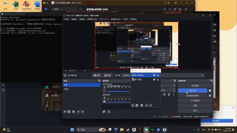

粒子引力仿真
基于Taichi 1.7.4 与 python 3.12.3 实现的粒子引力仿真

项目介绍
本项目实现了基础的粒子物理仿真：
- 粒子随机初始运动、边界反弹
- 粒子间近距离斥力与中距离引力
- 键盘（空格键）触发鼠标引力，粒子向鼠标位置聚拢
- 粒子颜色动态反馈（按住空格变红，松开变蓝）

环境要求
- Python 3.10+
- Taichi 1.7.4
- uv（或 pip）包管理工具

项目结构
particle-gravity-sim/
├── src/
│   └── work0/
│       ├── config.py    # 全局配置参数
│       ├── physics.py   # 物理引擎（粒子运动、相互作用）
│       └── main.py      # 主程序（GUI渲染+交互逻辑）
├── .gitignore
└── README.md

代码逻辑
1.config.py：
将所有可调节参数定义在此文件中，方便后续修改和调试
2.physics.py：
实现粒子的物理运动、相互作用（斥力、引力）等逻辑
在这里完成粒子初始化工作，粒子间相互作用的计算，基础物理更新，鼠标引力计算
3.main.py：
主程序，负责渲染GUI、处理用户交互等
利用帧循环，不断更新粒子状态，渲染到屏幕上

演示效果
